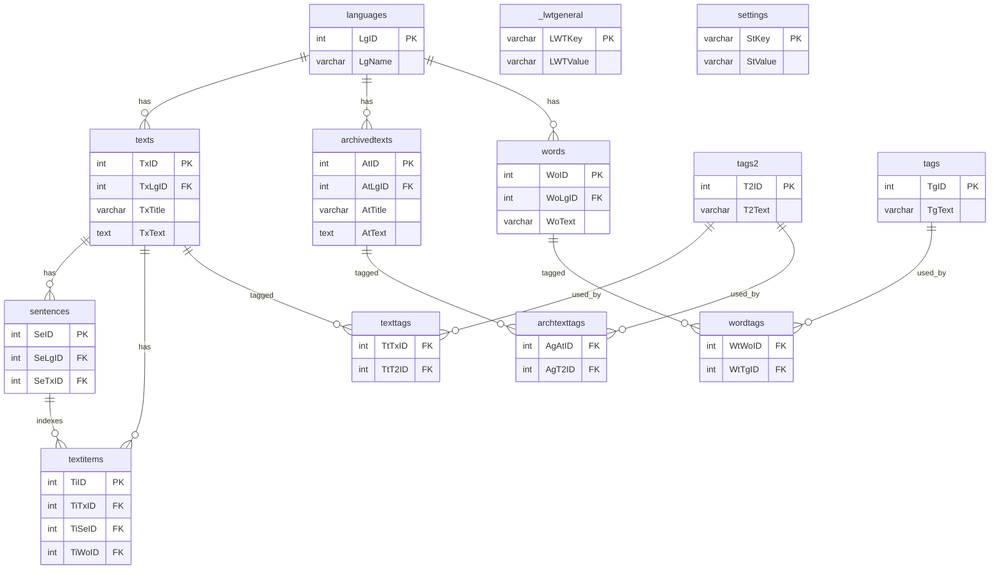

### Overview

- **Purpose**: Containerized runner for the Learning With Texts (LWT) PHP application.
- **Topology**: Two-container Docker Compose stack:
  - **`lwt`**: PHP 7.4 + Apache web server hosting the LWT PHP app.
  - **`db`**: MySQL 5.7 database with persistent storage.

### Services

- **Application (`lwt`)**
  - Base image: `php:7.4-apache`
  - Installs `mysqli` extension and MySQL client
  - Serves code from bind mount: `./lwt_html -> /var/www/html`
  - HTTP exposed on container port 80; mapped to host port `9090`
  - Built via root `Dockerfile`

- **Database (`db`)**
  - Image: `mysql:5.7`
  - Initializes database `lwt` via environment variables
  - Persists data in named volume `db_data -> /var/lib/mysql`

### Data & Configuration

- **Volumes**
  - `./lwt_html`: Local copy of upstream LWT PHP code; mounted read/write into the web container
  - `db_data`: Named volume for MySQL data persistence across restarts

- **Networking**
  - Default Compose network; `lwt` reaches `db` by service name
  - Host access: `[http://localhost:9090](http://localhost:9090)`

- **Environment** (from `docker-compose.yml`)
  - `MYSQL_DATABASE=lwt`
  - `MYSQL_ROOT_PASSWORD=root`
  - `MYSQL_ALLOW_EMPTY_PASSWORD=yes`

### Runtime flow

- Browser → `localhost:9090` → Apache in `lwt` → LWT PHP app → MySQL (`db`) via `mysqli`
- MySQL data persists in `db_data`

### Usage

- Build and run:
  - `docker compose build lwt`
  - `docker compose up lwt`
- Access the app at: `[http://localhost:9090](http://localhost:9090)` 

### Database schema

- **Engine**: MyISAM (no enforced foreign keys). Relations are logical by naming.
- **Core entities**: `languages`, `texts`, `archivedtexts`, `words`.
- **Tagging**:
  - `tags` ↔ `wordtags` for word-level tags
  - `tags2` ↔ `texttags` and `archtexttags` for text/archived text tags
- **Content structure**:
  - `sentences` and `textitems` index/slice `texts` content and link occurrences to `words`
- **Globals**: `_lwtgeneral`, `settings` key-value pairs

- Keys/fields shown are representative; the live schema includes additional columns (timestamps, annotations, URIs, status fields, etc.). 