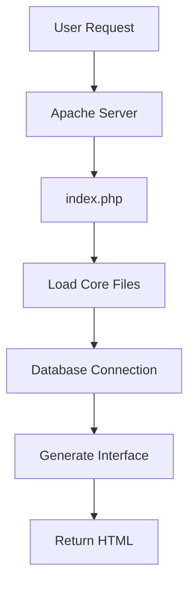
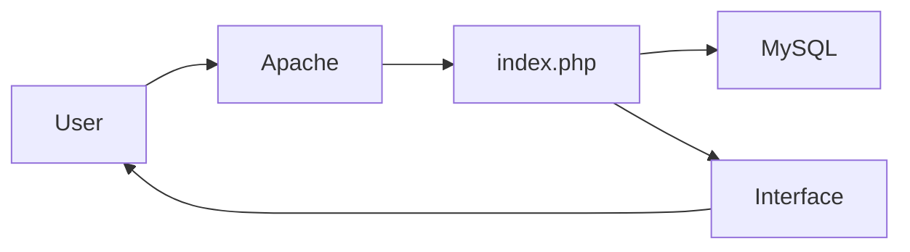
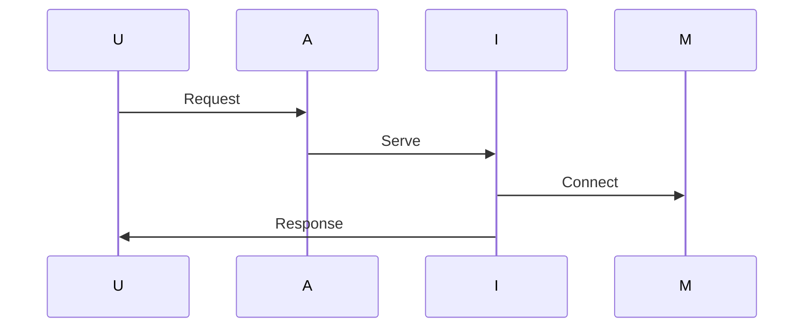

# LWT Code Execution Flow (Mermaid Live Compatible)

```mermaid
graph TD
    A[User Request] --> B[Apache Server]
    B --> C[index.php]
    C --> D[Load Core Files]
    D --> E[Database Connection]
    E --> F[Generate Interface]
    F --> G[Return HTML]
```

## Alternative Flow Diagram:

```mermaid
flowchart LR
    A[User] --> B[Apache]
    B --> C[index.php]
    C --> D[MySQL]
    C --> E[Interface]
    E --> A
```

## Simple Sequence:

```mermaid
sequenceDiagram
    participant U
    participant A
    participant I
    participant M

    U->>A: Request
    A->>I: Serve
    I->>M: Connect
    I->>U: Response
``` 