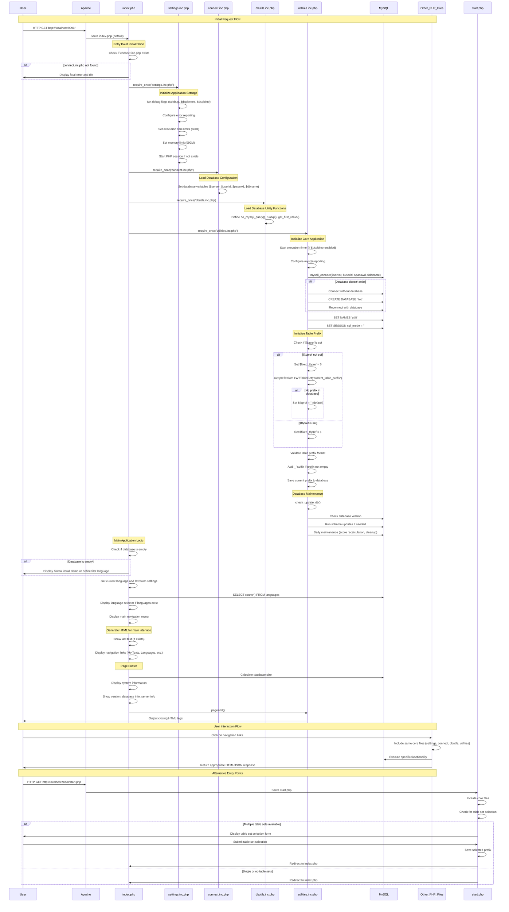

# LWT Application Code Execution Sequence Diagram

## Key Components and Their Roles:

### 1. **Entry Points**
- **`index.php`**: Main application entry point
- **`start.php`**: Table set selection entry point

### 2. **Core Initialization Files**
- **`settings.inc.php`**: Application configuration and session management
- **`connect.inc.php`**: Database connection parameters
- **`dbutils.inc.php`**: Database utility functions
- **`utilities.inc.php`**: Core application logic and database connection

### 3. **Database Layer**
- **MySQL**: Database server (MySQL 5.7 in Docker)
- **Connection**: Established via mysqli_connect()
- **Table Prefix**: Supports multiple table sets with prefixes

### 4. **Application Flow**
1. **Initialization**: Load core files and establish database connection
2. **Configuration**: Set up table prefixes and validate settings
3. **Maintenance**: Run daily database maintenance tasks
4. **Interface**: Generate main application interface
5. **Interaction**: Handle user navigation and functionality

### 5. **Error Handling**
- Database connection failures
- Missing configuration files
- Invalid table prefixes
- Session management issues

### 6. **Docker Integration**
- Apache serves files from `/var/www/html` (mapped to `./lwt_html`)
- MySQL container provides database service
- Port 9090 exposed for web access

This sequence diagram shows the complete flow from initial HTTP request through application initialization, database connection, and page rendering, including error handling and alternative entry points. 