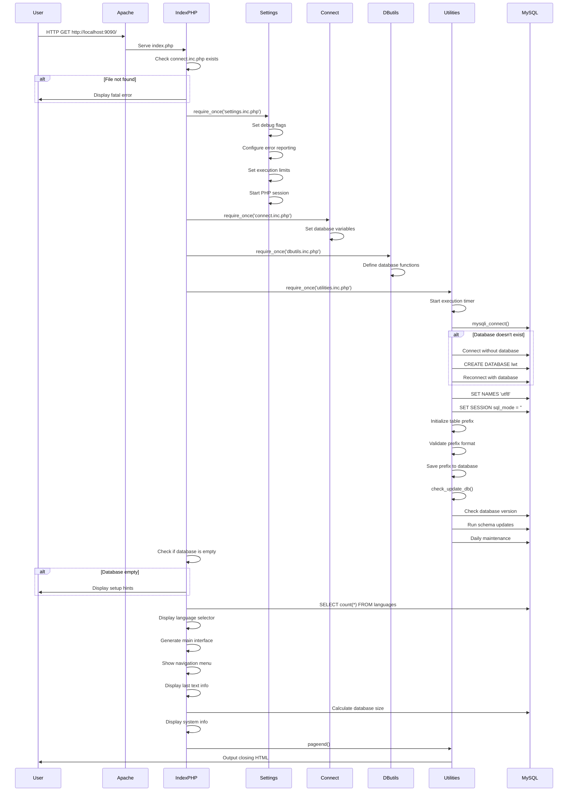

# LWT Application Code Execution Sequence Diagram

## Application Flow Summary:

1. **Entry Point**: `index.php` serves as main entry point
2. **Initialization**: Loads core files in sequence:
   - `settings.inc.php` - Application configuration
   - `connect.inc.php` - Database parameters  
   - `dbutils.inc.php` - Database utilities
   - `utilities.inc.php` - Core application logic
3. **Database Connection**: Establishes MySQL connection with error handling
4. **Configuration**: Sets up table prefixes and validates settings
5. **Maintenance**: Runs daily database maintenance tasks
6. **Interface**: Generates main application interface
7. **User Interaction**: Handles navigation and functionality

## Key Files:
- **Entry**: `index.php`, `start.php`
- **Core**: `settings.inc.php`, `connect.inc.php`, `dbutils.inc.php`, `utilities.inc.php`
- **Database**: MySQL 5.7 (Docker container)
- **Web Server**: Apache (serves from `/var/www/html`) 