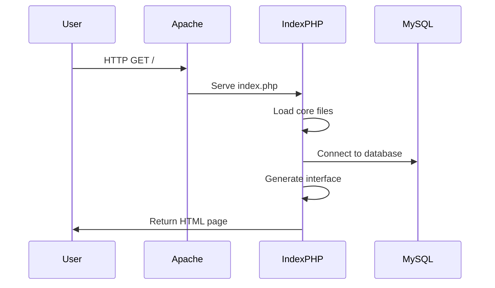

# LWT Code Execution Flow

## Flow Summary:
1. User requests page
2. Apache serves index.php
3. index.php loads core files
4. Database connection established
5. Interface generated
6. HTML returned to user 